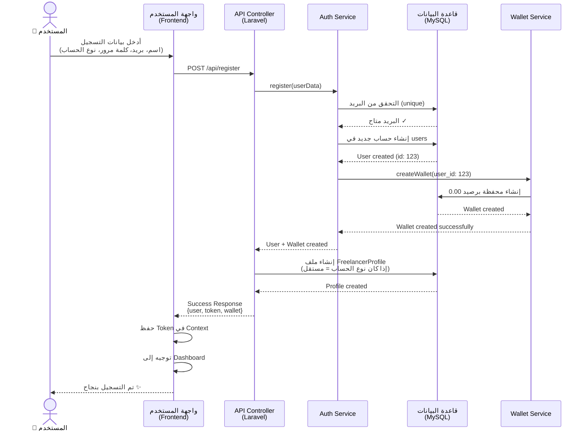
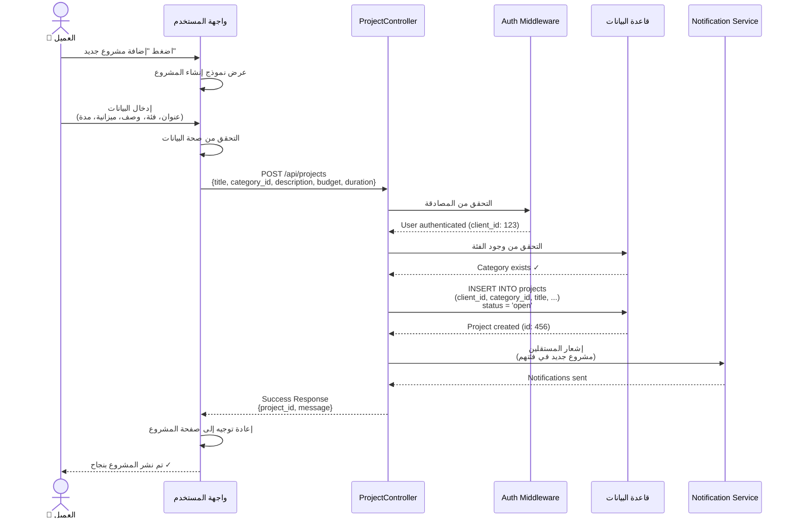
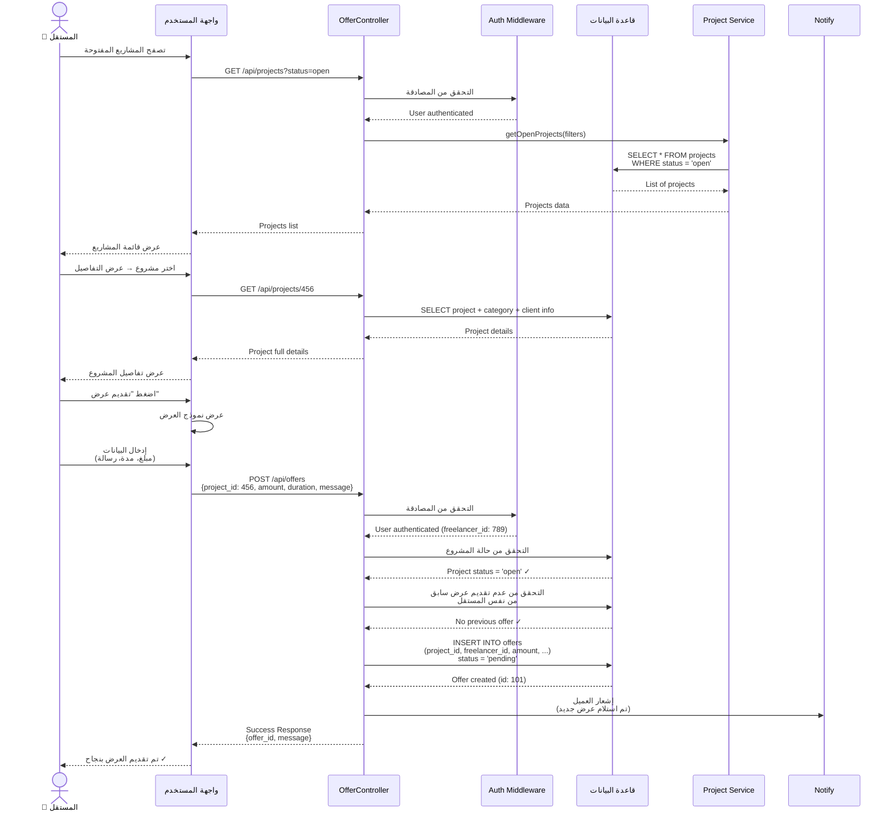
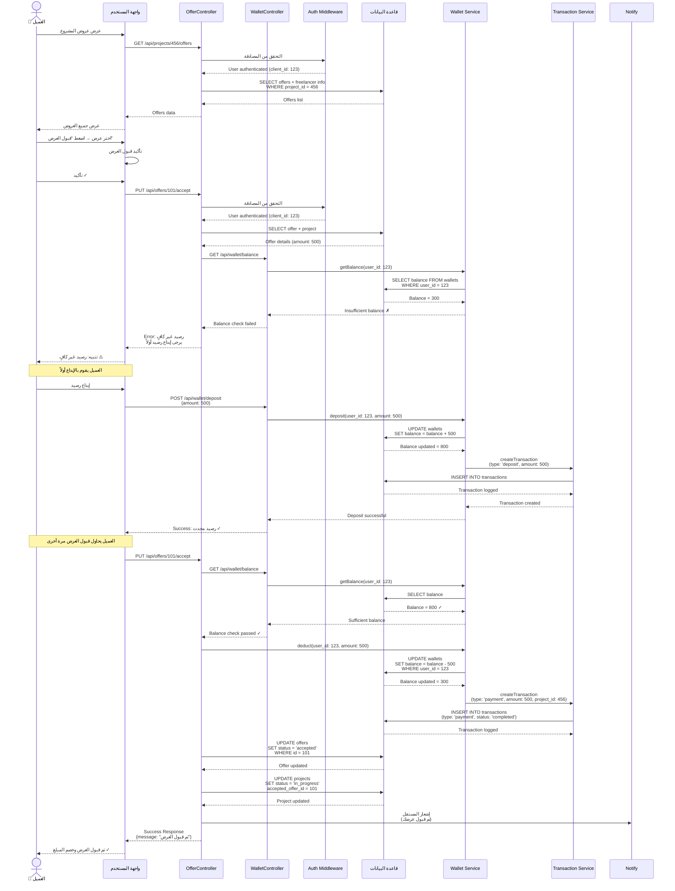
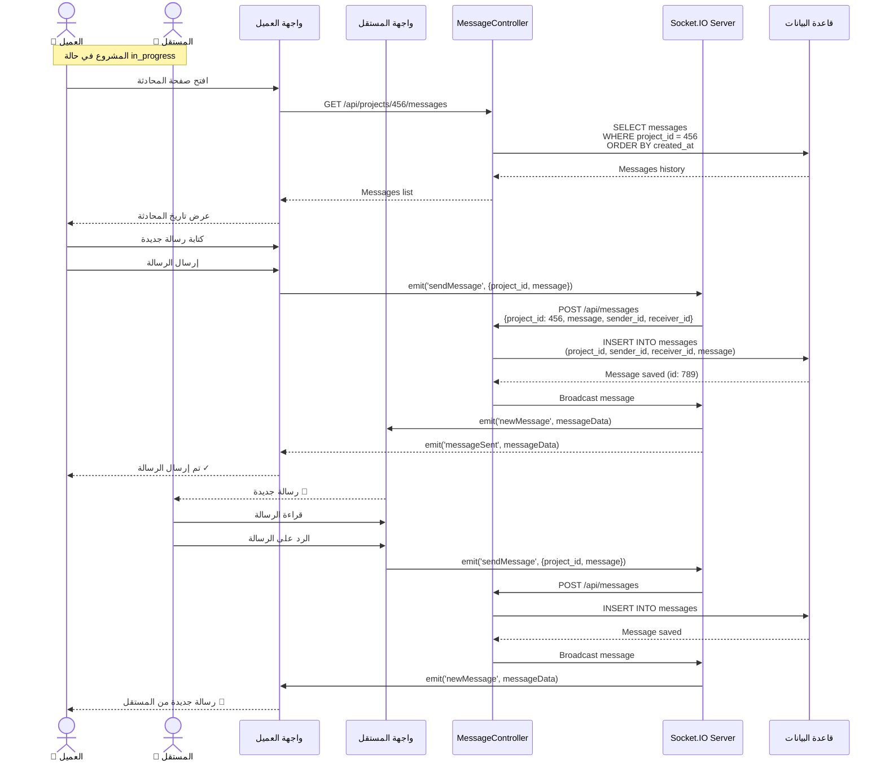
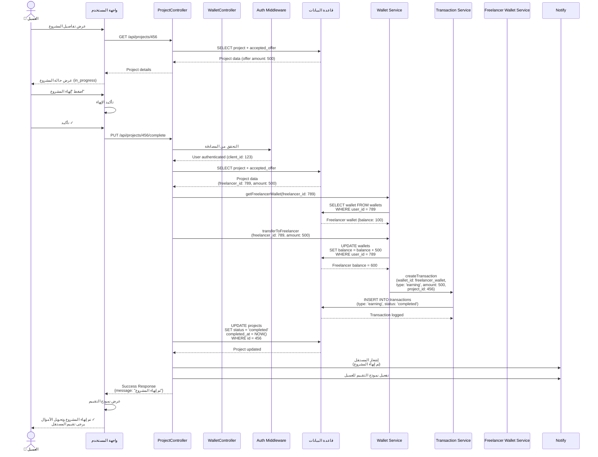
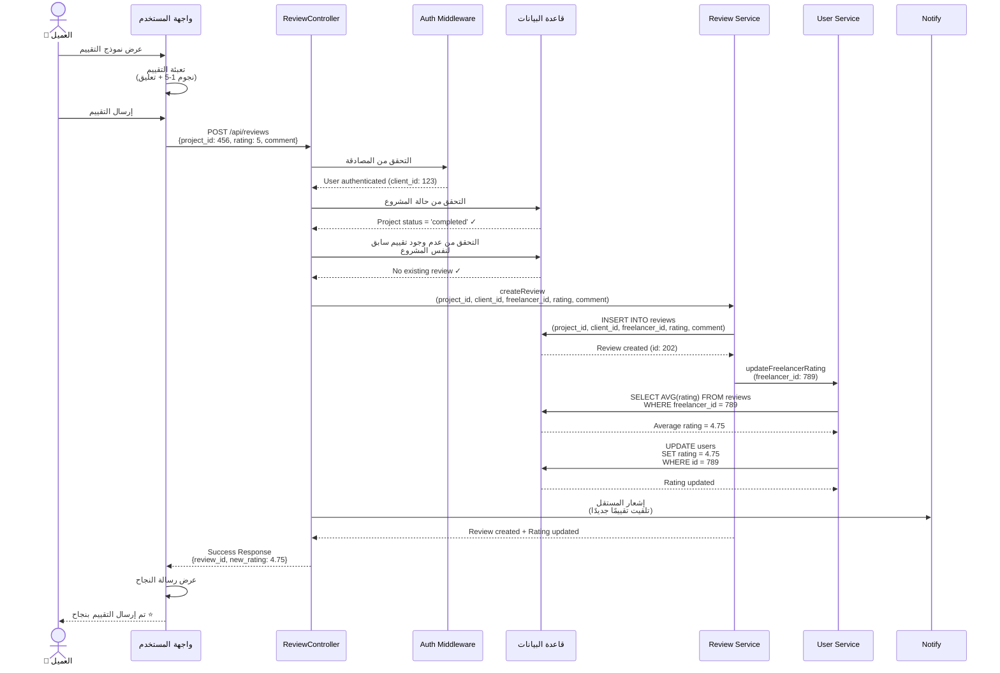
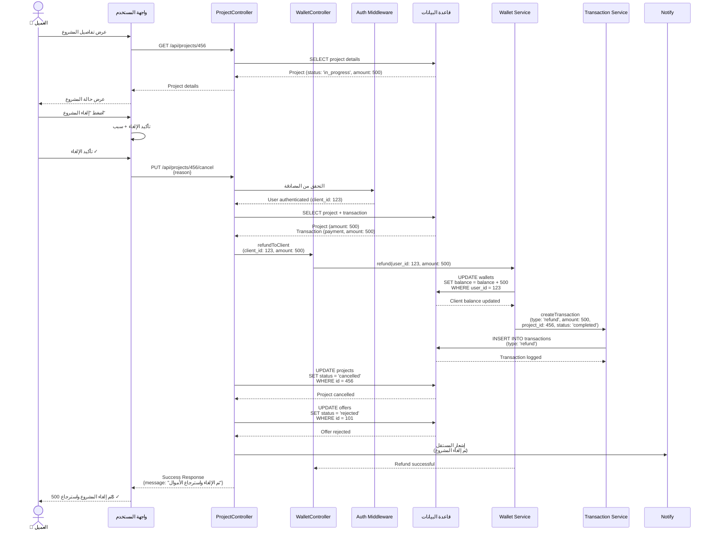
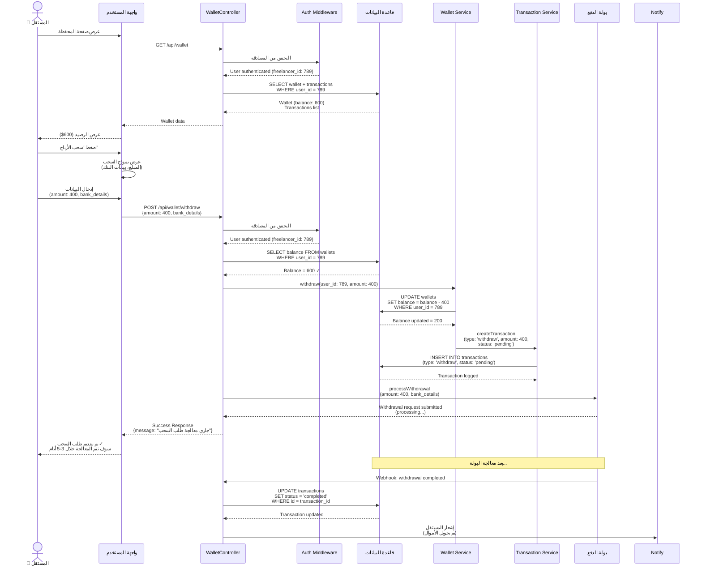
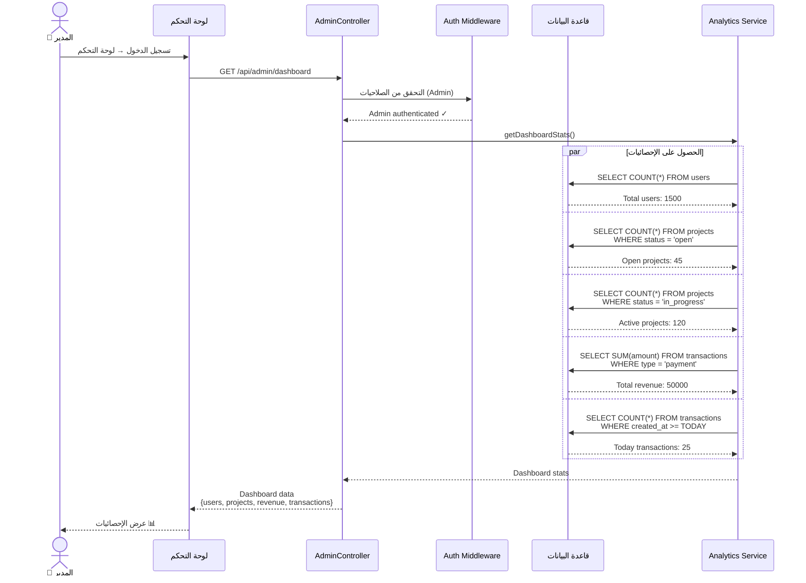

# 🔄 Sequence Diagrams - منصة الفريلانسر المتكاملة

## مخططات التسلسل (Sequence Diagrams)

توضح هذه المخططات التدفق التفصيلي للتفاعلات بين مختلف مكونات النظام خلال العمليات الرئيسية.

---

## 1. 📝 التسجيل وإنشاء الحساب (Registration & Account Creation)

---

## 2. 🚀 العميل ينشر مشروعًا جديدًا (Client Creates Project)

---

## 3. 💼 المستقل يتصفح ويقدم عرضًا (Freelancer Browses & Submits Offer)

---

## 4. ✅ العميل يقبل عرضًا ويتم الدفع (Client Accepts Offer & Payment)

---

## 5. 💬 التواصل أثناء التنفيذ (Communication During Execution)

---

## 6. ✅ إنهاء المشروع وتحويل الأموال (Complete Project & Transfer Funds)

---

## 7. ⭐ التقييم بعد الإنهاء (Rating After Completion)

---

## 8. ❌ إلغاء المشروع واسترجاع الأموال (Cancel Project & Refund)

---

## 9. 💰 المستقل يسحب الأرباح (Freelancer Withdraws Earnings)

---

## 10. 🔍 عرض إحصائيات المدير (Admin Views Analytics)

---

## 📋 ملخص المخططات

| رقم المخطط | العملية | الوصف |
|-----------|---------|-------|
| 1 | التسجيل | إنشاء حساب جديد ومحفظة |
| 2 | نشر مشروع | العميل ينشر مشروعًا جديدًا |
| 3 | تقديم عرض | المستقل يقدم عرضًا على مشروع |
| 4 | قبول العرض | العميل يقبل عرضًا ويتم الدفع |
| 5 | التواصل | الرسائل بين العميل والمستقل |
| 6 | إنهاء المشروع | إنهاء المشروع وتحويل الأموال |
| 7 | التقييم | تقييم المستقل بعد الإنهاء |
| 8 | الإلغاء | إلغاء المشروع واسترجاع الأموال |
| 9 | سحب الأرباح | المستقل يسحب أرباحه |
| 10 | إحصائيات المدير | عرض إحصائيات النظام |

---

## 💡 ملاحظات مهمة

1. **المصادقة**: جميع الطلبات تتطلب مصادقة أولاً (Auth Middleware)
2. **التحقق**: يتم التحقق من الحالة والصلاحيات قبل كل عملية
3. **المعاملات**: جميع العمليات المالية تسجل في جدول transactions
4. **الإشعارات**: يتم إرسال إشعارات عند الأحداث المهمة
5. **الأمان**: جميع العمليات محمية بطبقات أمان متعددة

---

## 🔗 التكامل بين المخططات

- **المخطط 1 → 2**: بعد التسجيل يمكن للعميل نشر مشروع
- **المخطط 2 → 3**: بعد نشر المشروع يمكن للمستقل تقديم عرض
- **المخطط 3 → 4**: بعد تقديم العرض يمكن للعميل قبوله
- **المخطط 4 → 5**: بعد قبول العرض يبدأ التواصل
- **المخطط 5 → 6**: بعد التواصل يتم إنهاء المشروع
- **المخطط 6 → 7**: بعد الإنهاء يتم التقييم
- **المخطط 9**: يمكن تنفيذه في أي وقت بعد وجود رصيد

